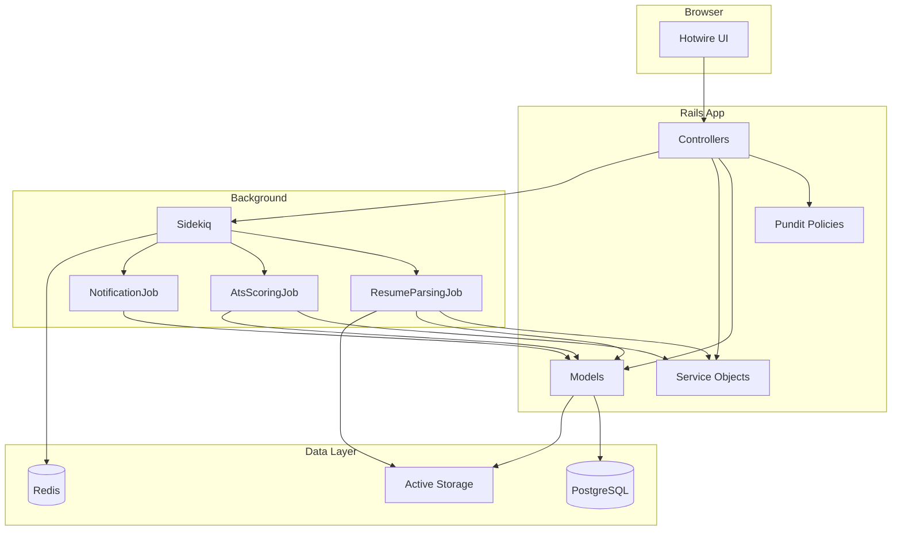

# HireFlow AI

An AI-assisted **Applicant Tracking System (ATS)** built with Ruby on Rails 7.1. HireFlow demonstrates production-style Rails patterns: Hotwire for a reactive UI, Sidekiq for background work, Pundit for authorization, and service objects for domain logic.

Recruiters manage jobs and move candidates through a pipeline. Candidates upload resumes, apply to roles, and receive ATS match scores. Admins get a system-wide overview and access to operational tools.

---

## Table of Contents

- [Features](#features)
- [Tech Stack](#tech-stack)
- [Architecture](#architecture)
- [Prerequisites](#prerequisites)
- [Quick Start (Docker)](#quick-start-docker)
- [Local Development](#local-development)
- [Demo Accounts](#demo-accounts)
- [Environment Variables](#environment-variables)
- [Background Jobs](#background-jobs)
- [Running Tests](#running-tests)
- [Project Structure](#project-structure)
- [Troubleshooting](#troubleshooting)
- [Roadmap](#roadmap)
- [License](#license)

---

## Features

### For recruiters

- Create and manage job postings (`draft`, `published`, `closed`)
- Kanban-style **hiring pipeline** with drag-and-drop status updates (Stimulus)
- View applications per job with ATS scores, matched/missing skills, and AI feedback
- Real-time updates via Turbo Streams when candidates apply or scores are ready

### For candidates

- Upload a **PDF resume** (Active Storage) with async text extraction
- Browse published jobs and submit applications
- See ATS match scores and feedback after background scoring completes
- Track application status and in-app notifications

### For admins

- System-wide **dashboard metrics** (query objects)
- Access to [Sidekiq Web UI](http://localhost:3000/sidekiq) for queue monitoring

### Platform capabilities

| Capability | Implementation |
|------------|----------------|
| Authentication | Devise (register, sign in, password recovery) |
| Authorization | Pundit policies per role and resource |
| ATS scoring | `AtsScoringService` — skill overlap, description keywords, experience weighting |
| AI feedback | `OpenAiFeedbackService` when `OPENAI_API_KEY` is set; keyword fallback otherwise |
| Resume parsing | PDF text extraction + skill/education/experience parsers |
| Real-time UI | Turbo Frames/Streams, Action Cable, Stimulus controllers |
| File storage | Active Storage (`local` by default, S3 optional) |

---

## Tech Stack

| Layer | Technology |
|-------|------------|
| Framework | Ruby on Rails 7.1 |
| Language | Ruby 3.2.4 |
| Database | PostgreSQL 16 |
| Cache / queue | Redis 7 + Sidekiq 7 |
| Frontend | Hotwire (Turbo + Stimulus), Tailwind CSS 4 |
| Auth | Devise |
| Authorization | Pundit |
| PDF parsing | `pdf-reader` |
| AI (optional) | `ruby-openai` |
| Testing | RSpec, FactoryBot, Shoulda Matchers, Capybara |

---

## Architecture



**Request flow (apply to job):**

1. Candidate submits an application → record created with status `applied`.
2. `AtsScoringJob` enqueued; waits if resume profile is still processing.
3. `AtsScoringService` computes score from skills, job description overlap, and experience.
4. Optional OpenAI enhancement for narrative feedback.
5. Turbo Stream broadcasts update score UI; `NotificationJob` notifies candidate and recruiter.

---

## Prerequisites

### Docker (recommended)

- [Docker Desktop](https://www.docker.com/products/docker-desktop/) (includes Docker Compose)
- No local Ruby, PostgreSQL, or Redis required

### Local development (optional)

- Ruby **3.2.4** (see `.ruby-version`)
- PostgreSQL 16+
- Redis 7+
- Bundler and Node.js (for Tailwind asset pipeline)

---

## Quick Start (Docker)

1. **Clone the repository**

   ```bash
   git clone <your-repo-url> hireflow-ai
   cd hireflow-ai
   ```

2. **Configure environment**

   ```bash
   cp .env.example .env
   ```

   Defaults in `.env.example` work with Docker Compose out of the box.

3. **Start all services**

   ```bash
   docker compose up --build
   ```

   This starts PostgreSQL, Redis, the Rails web server, and a Sidekiq worker. The web container runs migrations via `db:prepare` on startup.

4. **Seed demo data** (first run, in a second terminal)

   ```bash
   docker compose exec web rails db:seed
   ```

   Seeds are idempotent (`find_or_create_by`) — safe to run again.

5. **Open the app**

   [http://localhost:3000](http://localhost:3000)

### Useful Docker commands

| Command | Description |
|---------|-------------|
| `docker compose up` | Start services (foreground) |
| `docker compose up -d` | Start services (detached) |
| `docker compose down` | Stop and remove containers |
| `docker compose logs -f web` | Follow Rails logs |
| `docker compose exec web bash` | Shell into web container |
| `docker compose exec web rails console` | Rails console |

Data persists in the `postgres_data` Docker volume between restarts.

---

## Local Development

1. Install Ruby 3.2.4, PostgreSQL, and Redis.

2. Copy and adjust environment for localhost:

   ```bash
   cp .env.example .env
   ```

   Set `DATABASE_HOST=localhost` and `REDIS_URL=redis://localhost:6379/0` in `.env`.

3. Run setup:

   ```bash
   bin/setup
   ```

   Installs gems, prepares the database, and runs seeds.

4. Start processes (requires [Foreman](https://github.com/ddollar/foreman) or [Overmind](https://github.com/DarthSim/overmind)):

   ```bash
   bin/dev
   ```

   Or run individually in separate terminals:

   ```bash
   bundle exec rails server
   bundle exec rails tailwindcss:watch
   bundle exec sidekiq
   ```

---

## Demo Accounts

After seeding, sign in with:

| Role | Email | Password | Primary areas |
|------|-------|----------|-----------------|
| Admin | `admin@hireflow.ai` | `password123` | Admin dashboard, Sidekiq UI |
| Recruiter | `recruiter@hireflow.ai` | `password123` | Jobs, pipeline, applications |
| Candidate | `candidate@hireflow.ai` | `password123` | Browse jobs, resume, applications |

Additional seed user: `alex@hireflow.ai` (candidate) with sample applications across pipeline stages.

**Application pipeline statuses:** `applied` → `screening` → `interview` → `offer` → `hired` / `rejected`

---

## Environment Variables

Copy from [`.env.example`](.env.example):

| Variable | Required | Description |
|----------|----------|-------------|
| `DATABASE_HOST` | Yes | `db` in Docker; `localhost` locally |
| `DATABASE_USERNAME` | Yes | PostgreSQL user (default: `hireflow`) |
| `DATABASE_PASSWORD` | Yes | PostgreSQL password |
| `DATABASE_PORT` | Yes | Default: `5432` |
| `REDIS_URL` | Yes | Sidekiq + Action Cable |
| `SECRET_KEY_BASE` | Yes | Rails secret (use a long random string in production) |
| `RAILS_ENV` | Yes | `development`, `test`, or `production` |
| `ACTIVE_STORAGE_SERVICE` | No | `local` (default) or `amazon` |
| `OPENAI_API_KEY` | No | Enables richer AI feedback via OpenAI |
| `OPENAI_MODEL` | No | Default: `gpt-4o-mini` |
| `AWS_ACCESS_KEY_ID` | No | S3 storage in production |
| `AWS_SECRET_ACCESS_KEY` | No | S3 storage in production |
| `AWS_REGION` | No | e.g. `us-east-1` |
| `AWS_BUCKET` | No | Resume bucket name |

Paid third-party services are **optional**. ATS scoring and resume parsing work without OpenAI or AWS.

---

## Background Jobs

Sidekiq runs automatically in the `sidekiq` Docker service (or via `Procfile.dev` locally).

| Job | Purpose |
|-----|---------|
| `ResumeParsingJob` | Extract text and structured data from uploaded PDF resumes |
| `AtsScoringJob` | Score applications against job requirements; broadcast UI updates |
| `NotificationJob` | Create in-app notifications for candidates and recruiters |

**Sidekiq Web UI:** [http://localhost:3000/sidekiq](http://localhost:3000/sidekiq) (admin login required)

---

## Running Tests

With Docker:

```bash
docker compose exec web bundle exec rspec
```

Locally:

```bash
bundle exec rspec
```

Test coverage includes models, policies, services, and background jobs under `spec/`.

---

## Project Structure

```
app/
  controllers/       # Thin controllers; role namespaces (admin, recruiter, candidate)
  models/            # User, Job, Application, ResumeProfile, Notification
  services/          # ATS scoring, resume parsing, OpenAI feedback
  jobs/              # Sidekiq jobs (resume, ATS, notifications)
  policies/          # Pundit authorization rules
  queries/           # AdminStatsQuery for dashboard metrics
  views/             # Server-rendered ERB + Turbo partials
  javascript/        # Stimulus (pipeline, resume upload, ATS polling)
  channels/          # Action Cable connection setup

config/
  routes.rb          # Devise, jobs, applications, role dashboards
  database.yml       # PostgreSQL per environment

db/
  migrate/           # Schema migrations
  seeds.rb           # Demo users, jobs, and applications

spec/                # RSpec tests
docker-compose.yml   # db, redis, web, sidekiq services
```

### Key service objects

- **`AtsScoringService`** — Weighted score from skill match (60%), description similarity (25%), experience (15%)
- **`ResumeTextExtractor`** — PDF → plain text
- **`ResumeSkillExtractor`** / **`ResumeEducationParser`** / **`ResumeExperienceParser`** — Structured resume data
- **`OpenAiFeedbackService`** — Optional LLM-generated application feedback

---

## Troubleshooting

| Issue | Fix |
|-------|-----|
| Port 3000 already in use | Stop the other process or change the port mapping in `docker-compose.yml` |
| Database connection refused | Ensure Docker Desktop is running; wait for `db` healthcheck to pass |
| ATS score stays pending | Confirm Sidekiq is running; check resume profile `processing_status` is `completed` |
| `database does not exist` | Run `docker compose exec web rails db:prepare` |
| Empty UI / no demo data | Run `docker compose exec web rails db:seed` |
| Sidekiq UI forbidden | Sign in as `admin@hireflow.ai` |

---

## Roadmap

- [ ] Semantic similarity via embeddings (OpenAI or local model)
- [ ] Email notifications (Action Mailer + transactional provider)
- [ ] Interview scheduling module
- [ ] Multi-tenant organizations
- [ ] CI/CD pipeline and production deployment guide
- [ ] Expanded system test suite with Capybara

---

## License

MIT — intended for portfolio, learning, and demonstration use.
